# Verify Dependencies

This process template will help you ensure all the dependent projects for your application have been deployed to a target environment with a specific version.


## Use Case

In a perfect world, each project in Octopus Deploy is independently deployable.  However, the real world is messy and dependencies, even transient dependencies, continue to exist.  

The `Verify Dependencies` process template came about from previous experience.  Imagine working on a loan origination system at a bank.  The loan origination system was dependent upon multiple REST API services.  

- Customer Information Service - Truth center for the customer PII data.
- Financial Service - Truth center for the customer's financial information.
- Credit Service - Checked the customer's credit against the big three credit agencies.
- Collateral Service - Truth center for the customer's collateral.
- Decision Engine Service - Rules based engine that would auto-approve the loan or require additional verification.

Each of those services are managed by a different team, who had different priorities and deployment schedules.  The challenge is you'd make a change to our application based on functionality added in version `2.1.x` of the Financial Service, but production was running `2.0.5`.  The endpoints, requests, and responses wouldn't change.  It'd be all behind the scenes work.

### Dependency JSON

All the dependencies are managed via a JSON array you pass to the template.

```JSON
[
  {
    "projectName": "Spear",
    "versionPattern": ">1.0.54",        
    "deployGroup": 1,
    "promptedVariables": [
         {
             "name": "Prompted.Input.Variable",
             "value": "Dependency Checker"
         }
     ]
  },
  {
    "projectName": "TAKA",
    "versionPattern": "~2.4.0",        
    "deployGroup": 1
  },
  {
    "projectName": "TAWA",
    "versionPattern": "^4.0.0",        
    "dependencyAction": "Continue"
    "deployGroup": 2
  },
 {
    "projectName": "StoreHub",
    "versionPattern": ">1.0.3",
    "spaceName": "Default",    
    "tenantName": "Internal",    
    "deployGroup": 3
  }
]
```

The properties for each JSON object are:

- projectName - **Required** the name of the project of the dependency.
- versionPattern- **Required** the version pattern to match on.  See below for version information.
- deployGroup - **Optional** Projects in the same deploy group will be deployed concurrently.  Items in different deploy groups will be deployed sequentially.  If omitted all dependencies are deployed sequentially.  
- spaceName - **Optional** uses the current space if not provided.
- tenantName - **Optional** the name of the tenant to deploy.  If not specified when doing a multi-tenanted deployment it will use the current tenant being deployed.
- promptedVariables - **Optional** an array that lets you send in prompted variable values to the dependency project.  This will only work with string variable types, text, and sensitive values.
- dependencyAction - **Optional** overrides the default dependency action parameter.  For example, if you want to continue for a specific dependency but stop for all other dependencies.  The options are: 
    - `Stop` which will stop the deployment
    - `Continue` which will continue the deploy
    - `DeployNoMatchingInTarget` which will deploy only when no matching found
    - `DeployNewerMatching` which will deploy only when newer matching found

The version pattern follows Node's versioning scheme.  But it includes support for four digits (1.2.3.4) as well as three (1.2.3).  Any pre-release tags are removed prior to comparison.

- Exact version: 1.2.3.4 - only version 1.2.3.4 will be accepted.
- Greater than current: >1.2.3.4 - Any version greater than or equal to 1.2.3.4 will be accepted.  
- Caret range: ^1.2.3.4 - Allows minor, patch, and build updates, locking the major version.  Similar to 1.x.
- Tilde range: ~1.2.3.4 - Allows patch and build updates only, locking the major and minor versions.
- Major wildcard: 2.x - Allows any version or any version within a major range.

### Dependency Action

The step will use Octopus Deploy's API to determine if the dependent projects in the target environment match the version.  In the event a match doesn't occur, the step can:

- **Stop:** If one or more of the dependency checks fail it will stop and fail the deployment.  This is the **default.**
- **Continue:** Will proceed with the deployment even if the dependency check fails.  Will not attempt to deploy any dependent projects.
- **Deploy when newer matching found:** Will always deploy the latest matching version from the previous environment.  
- **Deploy only when no matching found:** Will trigger a deployment to the target environment only if the target environment doesn't include a matching version.  

The deploy options control when a deployment will occur.  For example, your pattern is >4.5.2.  

- Test 1 - The latest version in Production is 4.1.2 and in Test it is 4.5.7.  Deploy when newer will deploy 4.5.7.  Deploy when no matching will deploy 4.5.7.
- Test 2 - The latest version in Production is 4.5.3 and in test it is 4.5.7.  Deploy when newer will deploy 4.5.7.  Deploy when no matching WILL NOT deploy 4.5.7 because 4.5.3 matches the pattern >4.5.2.

### Requiring Approval

You can require an approval via an manual intervention to proceed when the dependency action is `Stop`, `Deploy when newer matching found` or `Deploy only when no matching found`.  

### Possibilities

There are 16 possible results for each dependency due to the various options in this step and the the current state of the in the source and target environment.  The table below will help you determine how each possibility can occur and the end result.

| Matching running in Target Env (Prod) | Matching running in Source Env (Test) | Test is Newer | Chosen Action            | Approval Requested | Failure | Deployment Needed | Approval Required |
| ------------------------------------- | ------------------------------------- | ------------- | ------------------------ | ------------------ | ------- | ----------------- | ----------------- |
| No                                    | No                                    | N/A           | Stop                     | Yes or No          | TRUE    | FALSE             | FALSE             |
| No                                    | No                                    | N/A           | Continue                 | Yes                | FALSE   | FALSE             | TRUE              |
| No                                    | No                                    | N/A           | Continue                 | No                 | FALSE   | FALSE             | FALSE             |
| No                                    | No                                    | N/A           | Deploy                   | Yes or No          | TRUE    | FALSE             | FALSE             |
| Yes                                   | N/A (Is first env in lifecycle)       | N/A           | Any                      | Yes or No          | FALSE   | FALSE             | FALSE             |
| No                                    | Yes                                   | N/A           | Stop                     | Yes or No          | TRUE    | FALSE             | FALSE             |
| No                                    | Yes                                   | N/A           | Continue                 | Yes                | FALSE   | FALSE             | TRUE              |
| No                                    | Yes                                   | N/A           | Continue                 | No                 | FALSE   | FALSE             | FALSE             |
| No                                    | Yes                                   | N/A           | Deploy                   | Yes                | FALSE   | TRUE              | TRUE              |
| No                                    | Yes                                   | N/A           | Deploy*                  | No                 | FALSE   | TRUE              | FALSE             |
| Yes                                   | Yes                                   | No            | Any                      | Yes or No          | FALSE   | FALSE             | FALSE             |
| Yes                                   | Yes                                   | Yes           | Stop                     | Yes or No          | FALSE   | FALSE             | FALSE             |
| Yes                                   | Yes                                   | Yes           | Continue                 | Yes or No          | FALSE   | FALSE             | FALSE             |
| Yes                                   | Yes                                   | Yes           | DeployNoMatchingInTarget | Yes or No          | FALSE   | FALSE             | FALSE             |
| Yes                                   | Yes                                   | Yes           | DeployNewerMatching      | Yes                | FALSE   | TRUE              | TRUE              |
| Yes                                   | Yes                                   | Yes           | DeployNewerMatching      | No                 | FALSE   | TRUE              | FALSE             |

### ITSM Approvals

The process template makes it possible to reuse change requests.  If a change request is created during the deployment, it will determine if the dependent projects require ITSM approval as well.  If they do, it will send down that change request number.  By default this is turned off, but can be enabled via a parameter.

### Prompted Variable Values

If a dependent project requires prompted variable values, you can supply them in the JSON.  It will match the prompted variable on the label or the variable name.  You can pass values to those prompted variables using Octostache syntax.

### Waiting for running deployments to complete

Before determining the version in the target environments and the source environment the process template will check to see if there are any running deployments.  In the event there are running deployments for the dependent project to the target environment or source environments it will wait for those deployments to finish.  

## Example Usage

As seen above, there are a lot of possible options when using this process template.  In this example, a project is created that relies on the following projects:

- Spear
- TAKA
- TAWA
- StoreHub - multi-tenanted

The dependency configuration is:

```JSON
[
  {
    "versionPattern": ">1.0.56",    
    "projectName": "Spear",    
  },
  {
    "versionPattern": "~2.4.0",    
    "projectName": "TAKA",    
  },
  {
    "versionPattern": "^4.0.0",    
    "projectName": "TAWA",
  },
 {
    "versionPattern": ">1.0.3",    
    "projectName": "StoreHub",
    "tenantName": "Internal",    
  }
]
```

The current state of the dependent applications are:

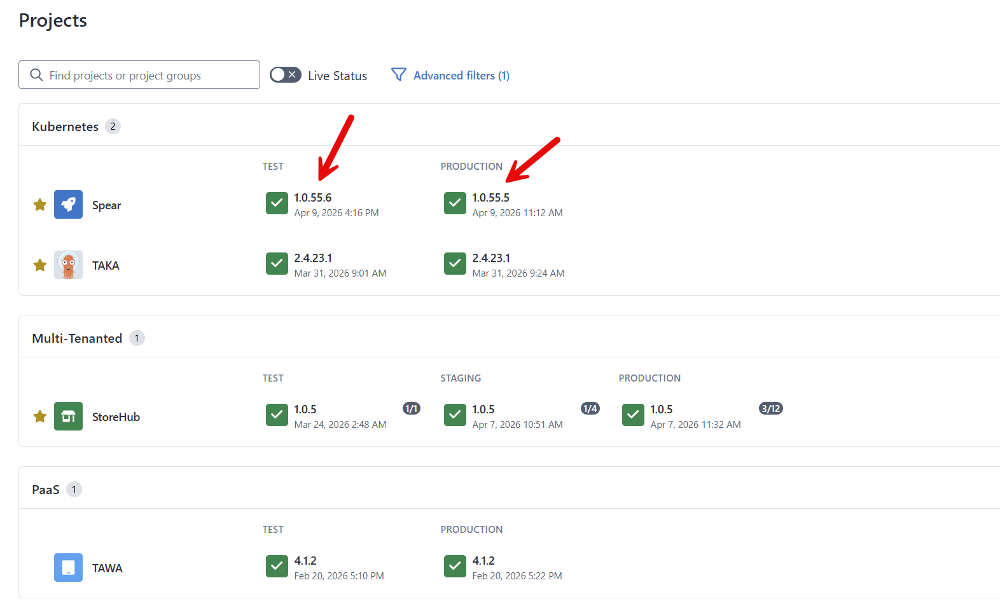

### Warn when missing dependencies found

This configuration is only concerned with warning the user in the event a dependency doesn't match the version pattern.  The settings will be:

- **Worker Pool**: Worker pool of your choice
- **API Key**: API Key of a service account who has permissions to view deployments in all environments.
- **Default Dependency Action**: Continue Deploy
- **Approval requested to proceed**: No
- **Approval teams**: Pick any
- **Reuse Change Request on Dependencies**: No (Default)
- **Target Tenant**: #{Octopus.Deployment.Tenant.Name} (Default)
- **Project Dependencies**: Same as JSON above

When a deployment runs the result will be:

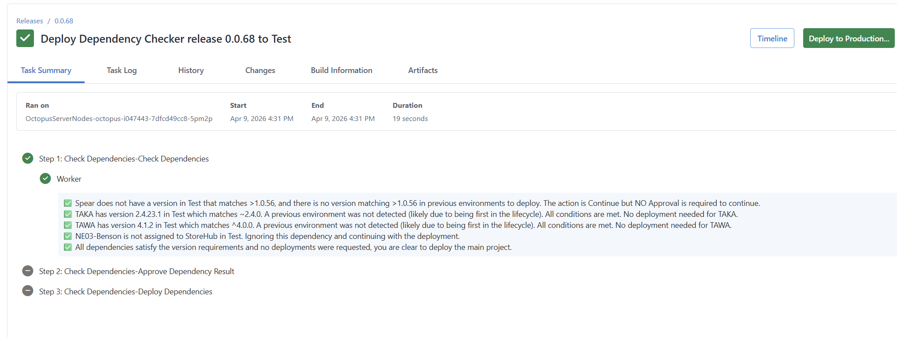

If you prefer, you can require approval before proceeding.  This allows someone to acknowledge the missing dependency.  This is the default behavior of the process template.

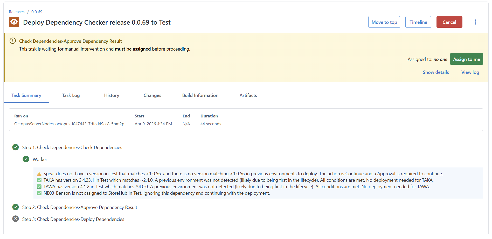

### Stop deployments when missing dependencies found

This configuration is will stop the deployment in the event a dependency doesn't match the version pattern.  The settings will be:

- **Worker Pool**: Worker pool of your choice
- **API Key**: API Key of a service account who has permissions to view deployments in all environments.
- **Default Dependency Action**: Stop Deployment
- **Approval requested to proceed**: No
- **Approval teams**: Pick any
- **Reuse Change Request on Dependencies**: No (Default)
- **Target Tenant**: #{Octopus.Deployment.Tenant.Name} (Default)
- **Project Dependencies**: Same as JSON above

The resulting deployment is:

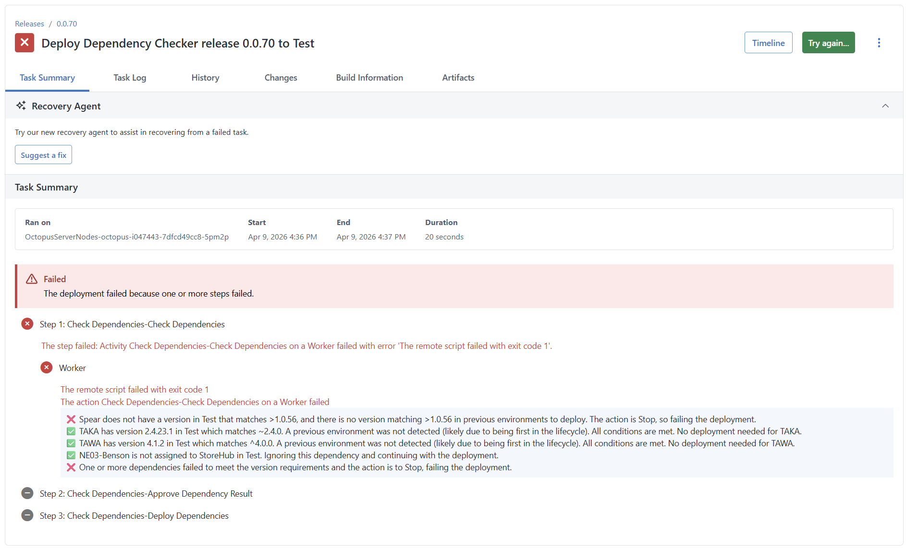

The approval parameter is superfluous when the action is set to `Stop Deployment`.  The failure will occur before the manual intervention step runs.

### Version in source environment is newer than target environment

In this example, version `1.0.53` is in `Production` but the step found `1.0.53.1`.  The step is configured to deploy when a new version is found, so it deployed that version to `Production`.

- **Worker Pool**: Worker pool of your choice
- **API Key**: API Key of a service account who has permissions to view deployments in all environments.
- **Default Dependency Action**: Deploy when new version is found
- **Approval requested to proceed**: Yes
- **Approval teams**: Pick any
- **Reuse Change Request on Dependencies**: No (Default)
- **Target Tenant**: #{Octopus.Deployment.Tenant.Name} (Default)
- **Project Dependencies**:
  
```JSON
[
  {
    "versionPattern": ">1.0.53",    
    "projectName": "Spear",
    "deployGroup": 1,
  },
  {
    "versionPattern": "~2.4.0",    
    "projectName": "TAKA",
    "deployGroup": 1
  },
  {
    "versionPattern": "^4.0.0",    
    "projectName": "TAWA",
    "deployGroup": 2
  },
 {
    "versionPattern": ">1.0.3",    
    "projectName": "StoreHub",
    "tenantName": "NE03-Benson",
    "deployGroup": 3
  }
]
```

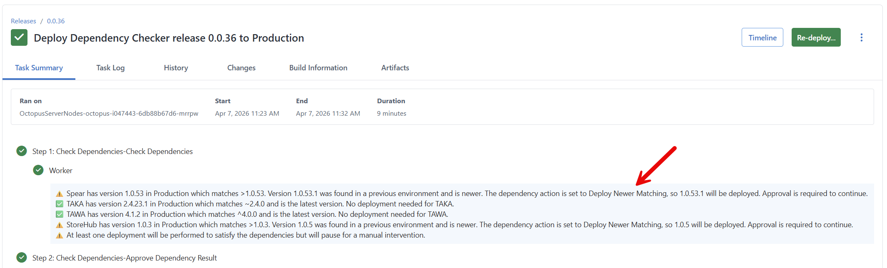

### Version 

In this example, version `1.0.53` is in `Production` but the step found `1.0.53.1`.  The step is configured to deploy when a new version is found, so it deployed that version to `Production`.

- **Worker Pool**: Worker pool of your choice
- **API Key**: API Key of a service account who has permissions to view deployments in all environments.
- **Default Dependency Action**: Deploy when new version is found
- **Approval requested to proceed**: Yes
- **Approval teams**: Pick any
- **Reuse Change Request on Dependencies**: No (Default)
- **Target Tenant**: #{Octopus.Deployment.Tenant.Name} (Default)
- **Project Dependencies**: Same as JSON above


## Example Results

As seen above, the step will behave differently based on current state of the deployments and the options configured.  This section will walk you through some common results.

### All dependencies meet requirements

When all the dependencies meet the requirements, regardless of configuration, the process template will notify you and the template will complete.  If approval or deployment options are chosen those steps will be skipped.

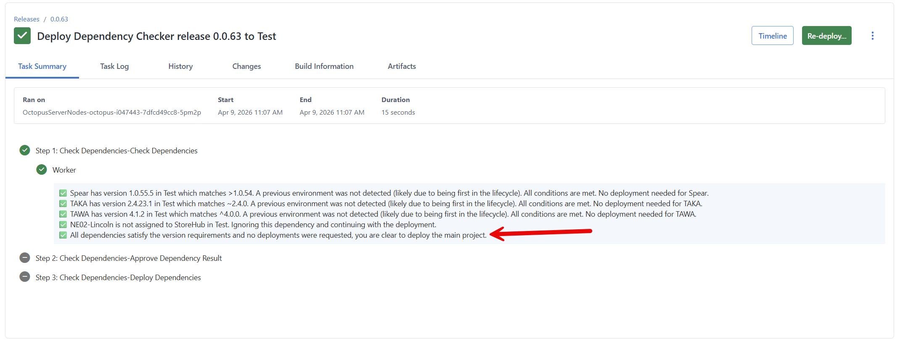

### Version to deploy isn't found in source environment

When the step is unable to find a version in the source environment matching the pattern to deploy it will stop the deployment when set to Stop or one of the deploy options.

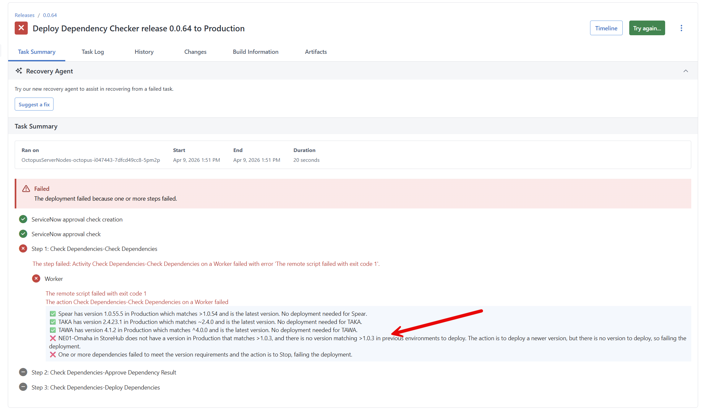

### Deploy without approval

In this example, version `1.0.54.2` is in `Production` but the step found `1.0.54.3` in a source environment to deploy.  The step is configured to deploy when a new version is found without approval.  So that version was deployed to production without stopping for an approval.

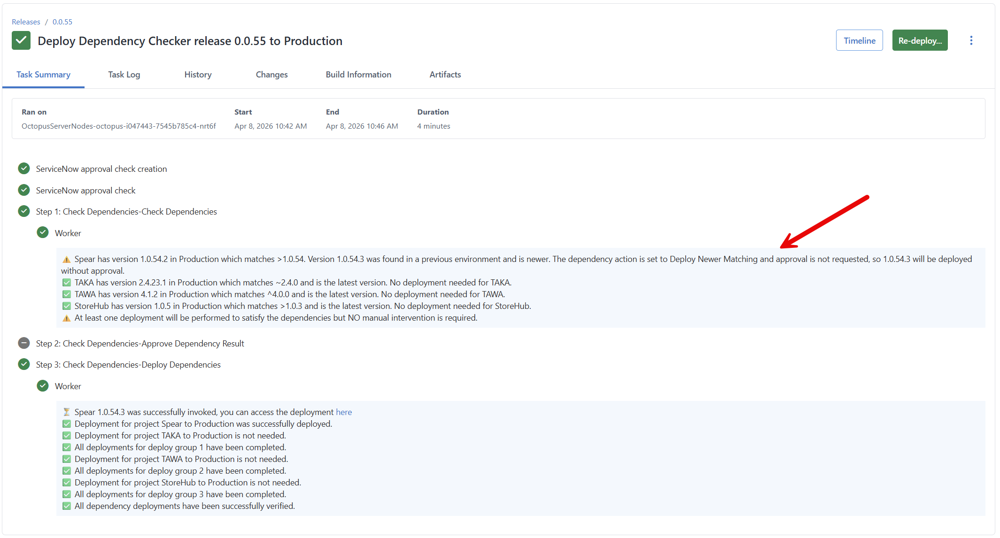

### Reuse change request number is set to yes

In this example, reuse the change request number is set to yes.  A change request is created in the parent project and that value is sent to the child when it invoked a deployment.

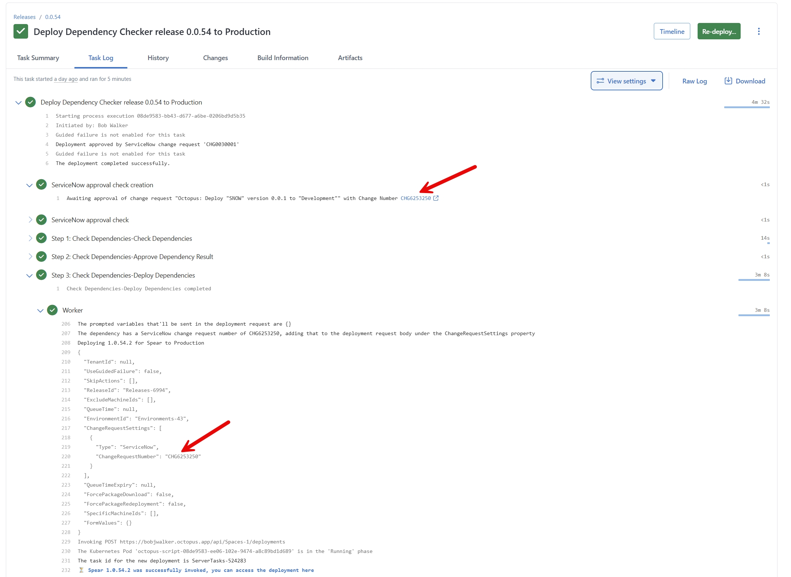

### Multi-Tenancy - Dependent project isn't configured for the target environment

In this scenario, the process template is attempting to deploy `1.0.5` to `Test` for `NE03-Benson`.  However, `NE03-Benson` isn't mapped to the `Test` environment.  

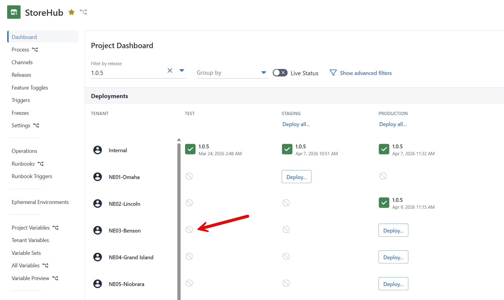

In any configuration, be it continue, deploy, or stop, the process template will notify you the tenant isn't mapped and continue.

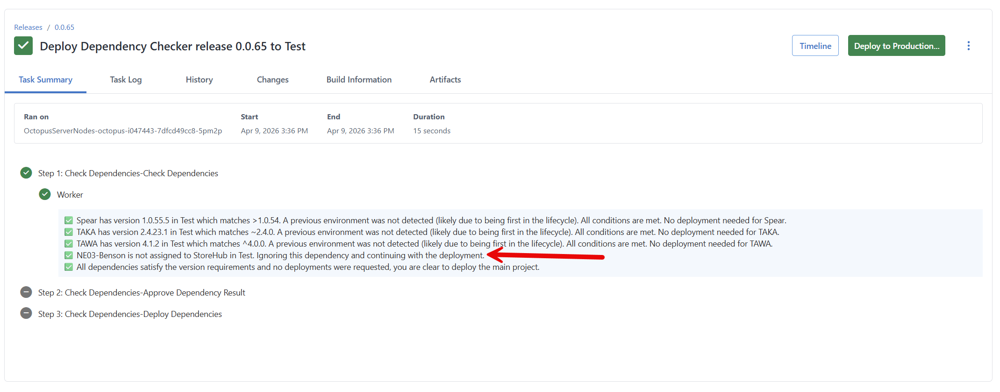

### Multi-Tenancy - Dependent project hasn't been deploy to target environment

In this scenario, the process template is attempting to deploy `1.0.5` to `Production` for `NE03-Benson`.  The project has been deployed for other tenants to `Test`, `Staging` and `Production` so it can be deployed to `Production` for `NE03-Benson`

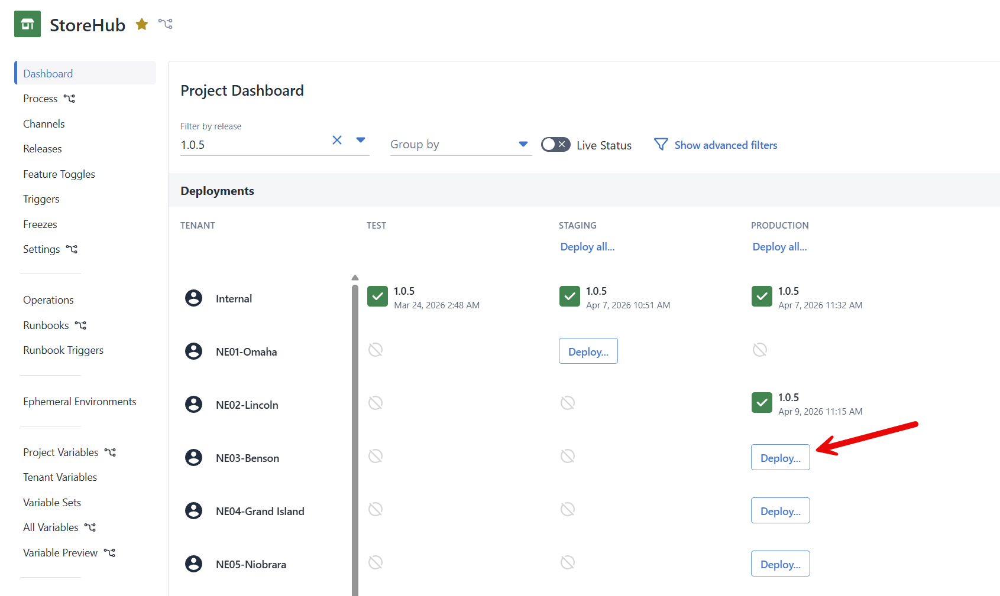

For the continue configuration it warn a deployment is needed. For the deploy and approve configuration, the validation will find the version and deploy it to `Production`.  

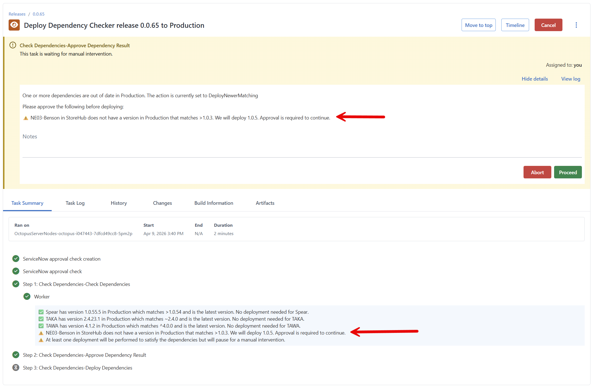

Once approval is received the deployment will proceed.

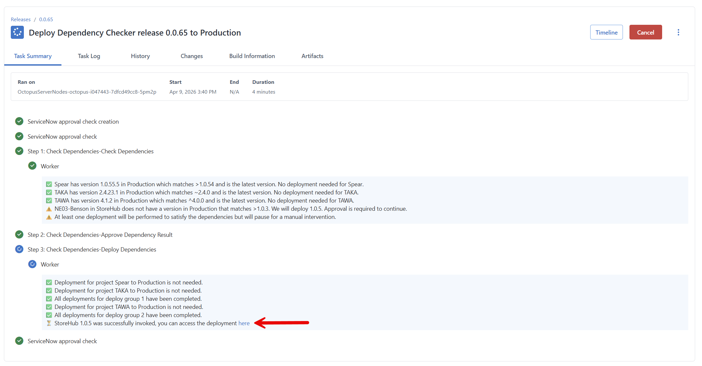

### Multi-Tenancy - Dependent project hasn't deployed to an earlier environment

In this scenario, the process template is attempting to deploy `1.0.5` to `Production` for `NE01-Omaha`.  As you can see, it hasn't been deployed to `Staging`.  

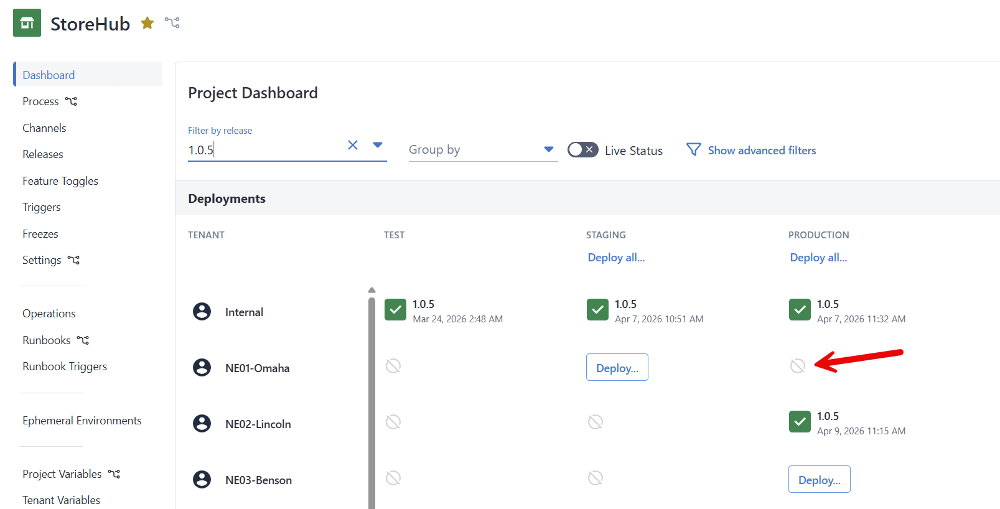

For any configuration, be it stop, deploy* or continue the validation will fail.  The step will either fail the deployment (stop or deploy* selected) or warn the user (continue).


## Assumptions Made

This template was designed with the following assumptions:

1. This process template is executed on the same Octopus Deploy instance as the dependencies.
2. All projects in the dependency tree will use the same ITSM approval system (if one uses SNoW they all use SNoW).
3. The worker pool has PowerShell installed on it.

## Expected Changes

The process template is rather complex.  If you want a simple "Are all the dependencies deployed?" check then delete the manual intervention and deployment step.