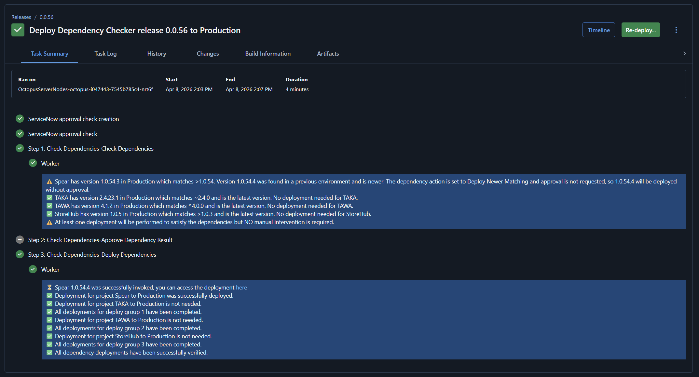

# Verify Dependencies

This process template will help you ensure all the dependent projects for your application have been deployed to a target environment with a specific version.



## Use Case

In a perfect world, each project in Octopus Deploy is independently deployable.  However, the real world is messy and dependencies, even transient dependencies, continue to exist.  This process template solves ensures all the dependent projects are running the appropriate version.  It will also let you approve and deploy those dependent projects.  

### Dependency JSON

You supply a JSON array of the project's dependencies.

```
[
  {
    "projectName": "Spear",
    "versionPattern": ">1.0.54",        
    "deployGroup": 1,
    "promptedVariables": [
         {
             "name": "Prompted.Input.Variable",
             "value": "Dependency Checker"
         }
     ]
  },
  {
    "projectName": "TAKA",
    "versionPattern": "~2.4.0",        
    "deployGroup": 1
  },
  {
    "projectName": "TAWA",
    "versionPattern": "^4.0.0",        
    "dependencyAction": "Continue"
    "deployGroup": 2
  },
 {
    "projectName": "StoreHub",
    "versionPattern": ">1.0.3",
    "spaceName": "Default",    
    "tenantName": "Internal",    
    "deployGroup": 3
  }
]
```

The properties for each JSON object are:

- projectName - **Required** the name of the project of the dependency.
- versionPattern- **Required** the version pattern to match on.  See below for version information.
- deployGroup - **Optional** Projects in the same deploy group will be deployed concurrently.  Items in different deploy groups will be deployed sequentially.  If omitted all dependencies are deployed sequentially.  
- spaceName - **Optional** uses the current space if not provided.
- tenantName - **Optional** the name of the tenant to deploy.  If not specified when doing a multi-tenanted deployment it will use the current tenant being deployed.
- promptedVariables - **Optional** an array that lets you send in prompted variable values to the dependency project.  This will only work with string variable types, text, and sensitive values.
- dependencyAction - **Optional** overrides the default dependency action parameter.  For example, if you want to continue for a specific dependency but stop for all other dependencies.  The options are: 
    - `Stop` which will stop the deployment
    - `Continue` which will continue the deploy
    - `DeployNoMatchingInTarget` which will deploy only when no matching found
    - `DeployNewerMatching` which will deploy only when newer matching found

The version pattern follows Node's versioning scheme.  But it includes support for four digits (1.2.3.4) as well as three (1.2.3).  Any pre-release tags are removed prior to comparison.

- Exact version: 1.2.3.4 - only version 1.2.3.4 will be accepted.
- Greater than current: >1.2.3.4 - Any version greater than or equal to 1.2.3.4 will be accepted.  
- Caret range: ^1.2.3.4 - Allows minor, patch, and build updates, locking the major version.  Similar to 1.x.
- Tilde range: ~1.2.3.4 - Allows patch and build updates only, locking the major and minor versions.
- Major wildcard: 2.x - Allows any version or any version within a major range.

### Dependency Action

The step will use Octopus Deploy's API to determine if the dependent projects in the target environment match the version.  In the event a match doesn't occur, the step can:

- **Stop:** If one or more of the dependency checks fail it will stop and fail the deployment.  This is the **default.**
- **Continue:** Will proceed with the deployment even if the dependency check fails.  Will not attempt to deploy any dependent projects.
- **Deploy when newer matching found:** Will always deploy the latest matching version from the previous environment.  
- **Deploy only when no matching found:** Will trigger a deployment to the target environment only if the target environment doesn't include a matching version.  

The deploy options control when a deployment will occur.  For example, your pattern is >4.5.2.  

- Test 1 - The latest version in Production is 4.1.2 and in Test it is 4.5.7.  Deploy when newer will deploy 4.5.7.  Deploy when no matching will deploy 4.5.7.
- Test 2 - The latest version in Production is 4.5.3 and in test it is 4.5.7.  Deploy when newer will deploy 4.5.7.  Deploy when no matching WILL NOT deploy 4.5.7 because 4.5.3 matches the pattern >4.5.2.

### Requiring Approval

You can require an approval via an manual intervention to proceed when the dependency action is `Stop`, `Deploy when newer matching found` or `Deploy only when no matching found`.  

### Possibilities

There are 16 possible results for each dependency due to the various options in this step and the the current state of the in the source and target environment.  The table below will help you determine how each possibility can occur and the end result.

| Matching running in Target Env (Prod) | Matching running in Source Env (Test) | Test is Newer | Chosen Action            | Approval Requested | Failure | Deployment Needed | Approval Required |
| ------------------------------------- | ------------------------------------- | ------------- | ------------------------ | ------------------ | ------- | ----------------- | ----------------- |
| No                                    | No                                    | N/A           | Stop                     | Yes or No          | TRUE    | FALSE             | FALSE             |
| No                                    | No                                    | N/A           | Continue                 | Yes                | FALSE   | FALSE             | TRUE              |
| No                                    | No                                    | N/A           | Continue                 | No                 | FALSE   | FALSE             | FALSE             |
| No                                    | No                                    | N/A           | Deploy                   | Yes or No          | TRUE    | FALSE             | FALSE             |
| Yes                                   | N/A (Is first env in lifecycle)       | N/A           | Any                      | Yes or No          | FALSE   | FALSE             | FALSE             |
| No                                    | Yes                                   | N/A           | Stop                     | Yes or No          | TRUE    | FALSE             | FALSE             |
| No                                    | Yes                                   | N/A           | Continue                 | Yes                | FALSE   | FALSE             | TRUE              |
| No                                    | Yes                                   | N/A           | Continue                 | No                 | FALSE   | FALSE             | FALSE             |
| No                                    | Yes                                   | N/A           | Deploy                   | Yes                | FALSE   | TRUE              | TRUE              |
| No                                    | Yes                                   | N/A           | Deploy*                  | No                 | FALSE   | TRUE              | FALSE             |
| Yes                                   | Yes                                   | No            | Any                      | Yes or No          | FALSE   | FALSE             | FALSE             |
| Yes                                   | Yes                                   | Yes           | Stop                     | Yes or No          | FALSE   | FALSE             | FALSE             |
| Yes                                   | Yes                                   | Yes           | Continue                 | Yes or No          | FALSE   | FALSE             | FALSE             |
| Yes                                   | Yes                                   | Yes           | DeployNoMatchingInTarget | Yes or No          | FALSE   | FALSE             | FALSE             |
| Yes                                   | Yes                                   | Yes           | DeployNewerMatching      | Yes                | FALSE   | TRUE              | TRUE              |
| Yes                                   | Yes                                   | Yes           | DeployNewerMatching      | No                 | FALSE   | TRUE              | FALSE             |

### ITSM Approvals

The process template makes it possible to reuse change requests.  If a change request is created during the deployment, it will determine if the dependent projects require ITSM approval as well.  If they do, it will send down that change request number.  By default this is turned off, but can be enabled via a parameter.

### Prompted Variable Values

If a dependent project requires prompted variable values, you can supply them in the JSON.  It will match the prompted variable on the label or the variable name.  You can pass values to those prompted variables using Octostache syntax.

## Assumptions Made

This template was designed with the following assumptions:

1. This process template is executed on the same Octopus Deploy instance as the dependencies.
2. All projects in the dependency tree will use the same ITSM approval system (if one uses SNoW they all use SNoW).
3. The worker pool has PowerShell installed on it.

## Expected Changes

The process template is rather complex.  If you want a simple "Are all the dependencies deployed?" check then delete the manual intervention and deployment step.

